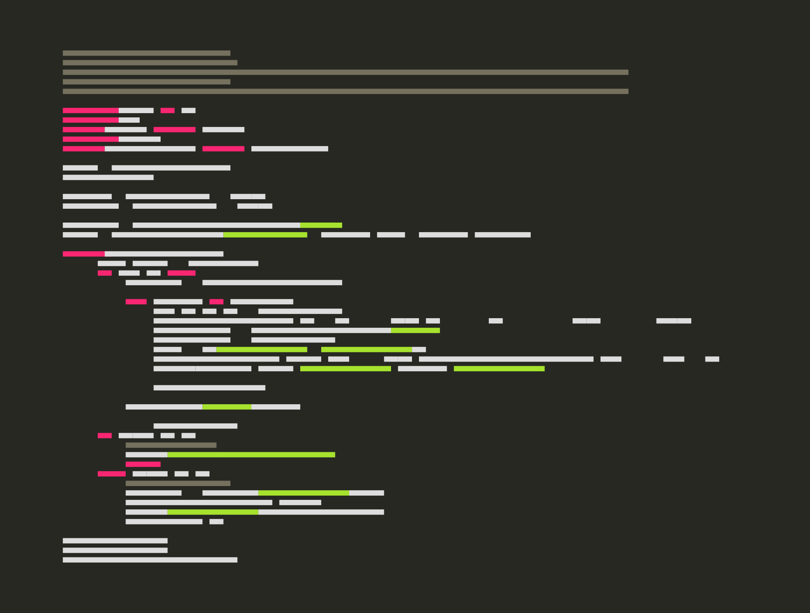

----

=======

> *Scripts I created for utilizing various libraries, more comming soon*

----

----

Table of Contents

----

#  Table of Contents

- [Barcode](https://github.com/willgrant22/Functional_Python/tree/master/Barcode)

- [C With Python](https://github.com/willgrant22/Functional_Python/tree/master/C%20With%20Python)

- [Database](https://github.com/willgrant22/Functional_Python/tree/master/Database)

- [Encryption](https://github.com/willgrant22/Functional_Python/tree/master/Encryption)

- [File Operations](https://github.com/willgrant22/Functional_Python/tree/master/File%20Operations)

- [GUI](https://github.com/willgrant22/Functional_Python/tree/master/GUI)

- [Image Manipulation](https://github.com/willgrant22/Functional_Python/tree/master/Image%20Manipulation)

- [Matplotlib](https://github.com/willgrant22/Functional_Python/tree/master/Matplotlib)

- [Numpy](https://github.com/willgrant22/Functional_Python/tree/master/Numpy)

- [Pandas](https://github.com/willgrant22/Functional_Python/tree/master/Pandas)

- [PyArduino](https://github.com/willgrant22/Functional_Python/tree/master/PyArduino)

- [Socket Programming](https://github.com/willgrant22/Functional_Python/tree/master/Socket%20Programming)

- [Strings](https://github.com/willgrant22/Functional_Python/tree/master/Strings)

- [System](https://github.com/willgrant22/Functional_Python/tree/master/System)

- [Terminal](https://github.com/willgrant22/Functional_Python/tree/master/Terminal)

- [Threading](https://github.com/willgrant22/Functional_Python/tree/master/Threading)

- [Twilio](https://github.com/willgrant22/Functional_Python/tree/master/Twilio)

- [Vars](https://github.com/willgrant22/Functional_Python/tree/master/Vars)

- [Walrus](https://github.com/willgrant22/Functional_Python/tree/master/Walrus)

- [Web](https://github.com/willgrant22/Functional_Python/tree/master/Web)
  
  

